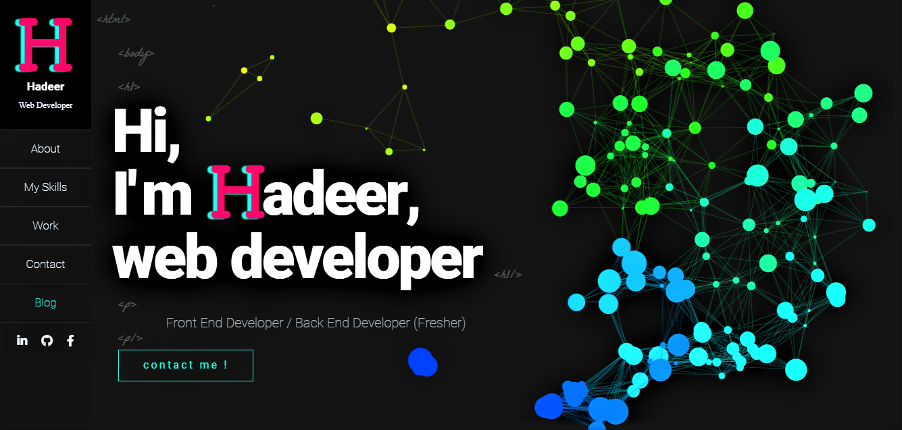
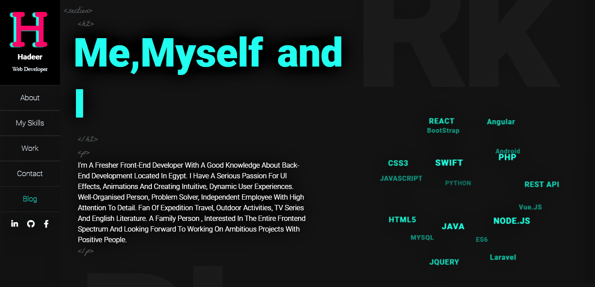
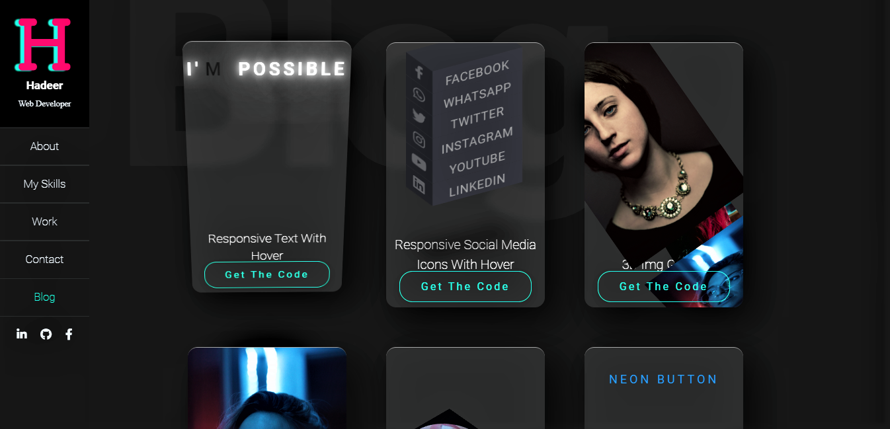
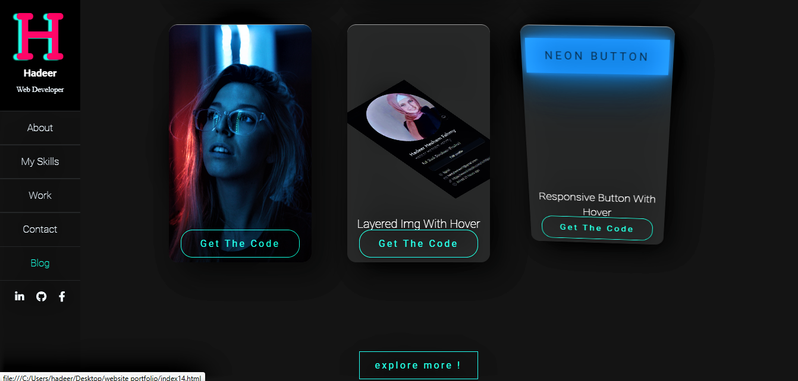
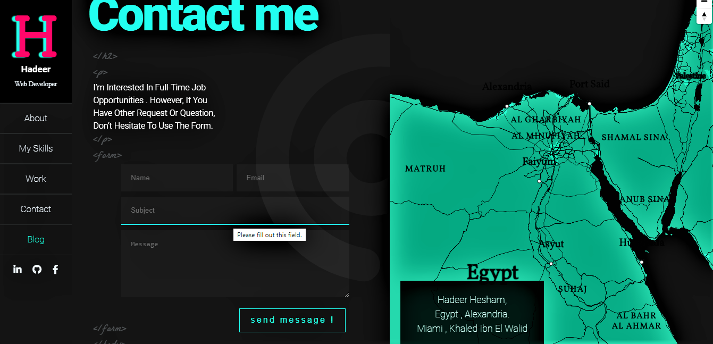
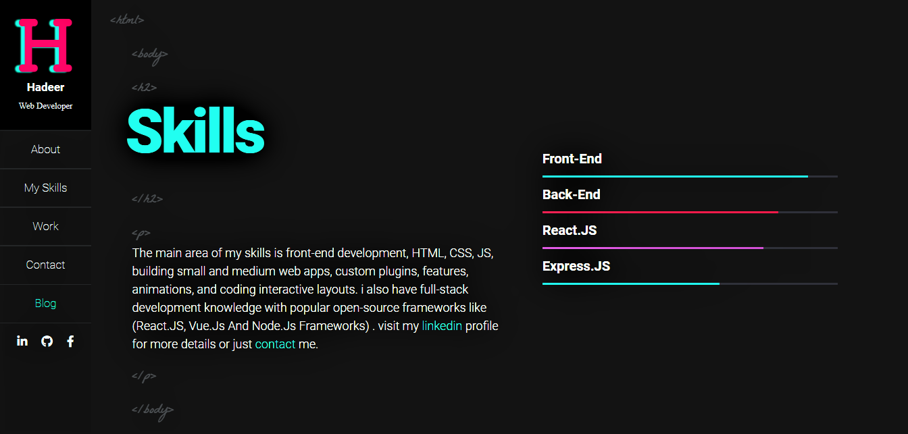

# portfolio-website

- This is (my portfolio website): A website for an online representation of work i have created, as well as my skills.
Here is the preview video: <a href="https://drive.google.com/file/d/1bnT7qfhJ9dCv1S7GYoHDuj1JaTt8CB-m/view?usp=drivesdk">From Here</a>
or <a href="https://www.linkedin.com/posts/hadeer-hesham-fahmy-45bb671b8_project-portfoliowebsite-activity-6945016539959959552-oMQ6?utm_source=linkedin_share&utm_medium=android_app"> Here </a>

- Things used in this project:
  1. Pure JavaScript
  2. HTML5 & CSS3
  3. No JavaScript frameworks 
  4. API (For the map section)
  5. Canvas (For the cloud of skills)
  6. vanilla JavaScript (for tilting the cards in the blog)
 
- Feel free to get to it whenever you want to check any feature's code

- Really I will appreciate your feedback 🤍🙏🏻

  

  

  

  

  

  

